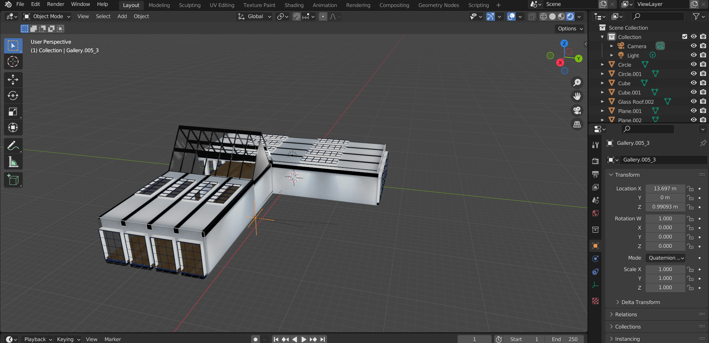
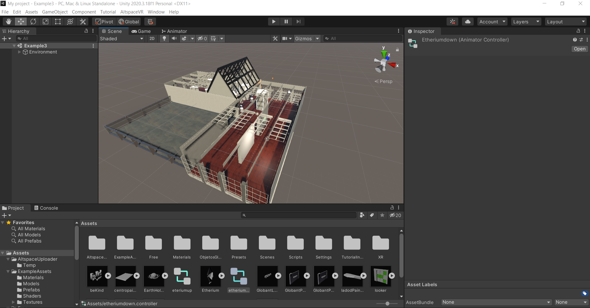

# AltspaceMetaversity

I helped design and created a space, in which the goal is to educate about the metaverse, a space for casual gatherings where people can do some fun activities 
while interacting with each other. The environment was built with Blender, as well as some objects, others were downloaded from sites like Sketchfab. 
All the content was later exported to Unity, where some objects could be animated so that finally the world could be personalized in Altspace . 
Microsoft defines AltspaceVR as: "the leading platform for live mixed reality experiences. AltspaceVR allows artists, creators, brands, and businesses 
to more easily create virtual events. People from around the world can use this social application to connect and collaborate in real time with a true sense of presence."

:beginner:The image below refers to creating the enviroment in Blender:

The image below refers to creating the enviroment exported to Unity:

:school:The image below is part of the environment that the user has access to:

